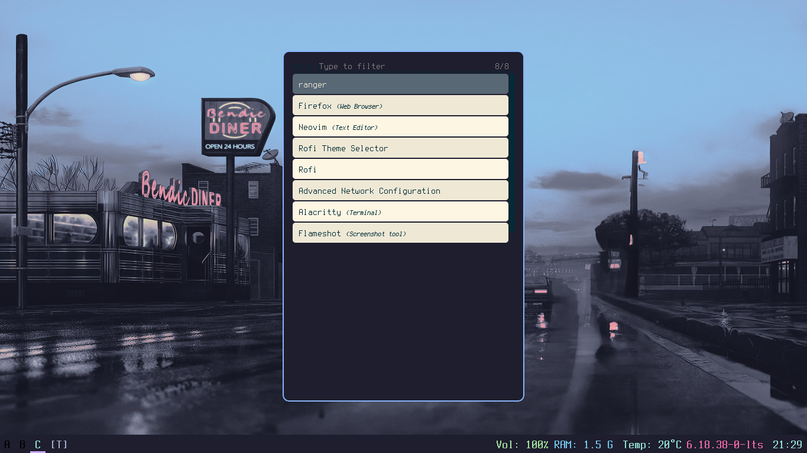
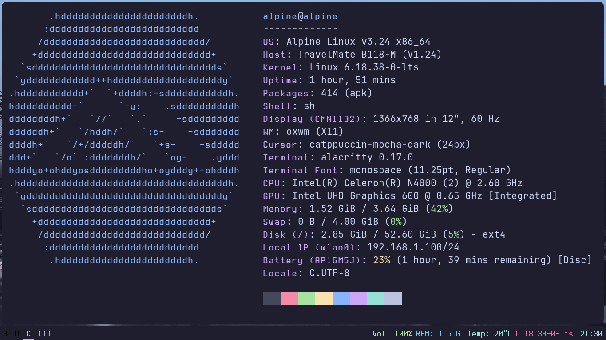

# oxwm-catppuccin-mocha-rice
an simple but strong oxwm rice based on catppuccin mocha... it will include dotfiles for oxwm, picom, grub and rofi

## Why OxWM & Catppuccin
*oxwm* is a fast, lightweight window manager, but finding clean and cohesive themes for it can be a challenge. Pairing it with the **Catppuccin Mocha** palette bridges that gap, giving you a gorgeous, easy-on-the-eyes interface while keeping your system lightning fast and minimal.

## Things Needed For The Dotfiles
- window manager: oxwm
- terminal: alacritty
- application launcher: rofi
- compositor (for rounded corners): picom
- wallpaper setter: feh
- bootloader (for system): grub
- system fetch (optional): fastfetch
- screnshoot tool (optional):  flameshot
- font for the bar (optional but default in the config): jetbrains mono nerd

## 🛠️ How to Customize
I've kept the config clean and easy to edit:
- **Wallpaper:** Change your image file in `~/Pictures/wallpaper/` and update the path in your `feh` command or `oxwm` config.
- **Colors:** If you want to tweak the Catppuccin accents, check the `color` variables inside `oxwm/config.lua` or your `.rasi` file.
- **Font:** To change the font size, edit the `font` line in `alacritty/alacritty.toml`.

## ⌨️ Keybindings

Here are the default bindings to get you started:

| Action | Keybinding |
| :--- | :--- |
| Open Terminal | `Super + T` |
| Launch Rofi | `Super + D` |
| Close Window | `Super + Q` |
| Restart OxWM | `Super + Shift + R` |
| Take Screenshot | `Print` |

## Showcase

## 🎨 Credits
- **Color Palette:** Big thanks to the [Catppuccin](https://github.com/catppuccin/catppuccin) team for the amazing Mocha theme.
- **Inspiration:** This rice was built to solve the lack of consistent theming for `oxwm`.
