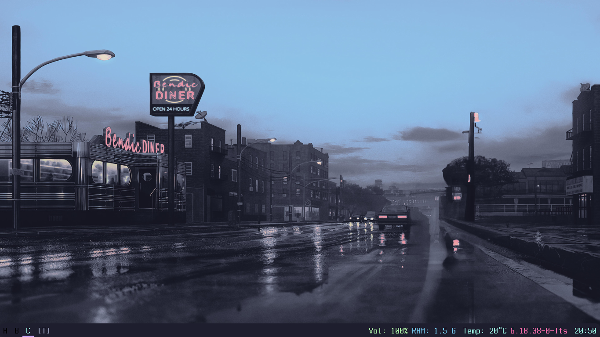
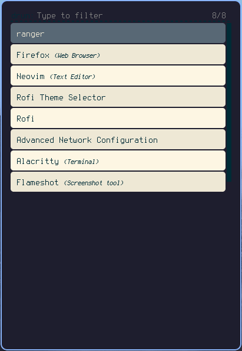
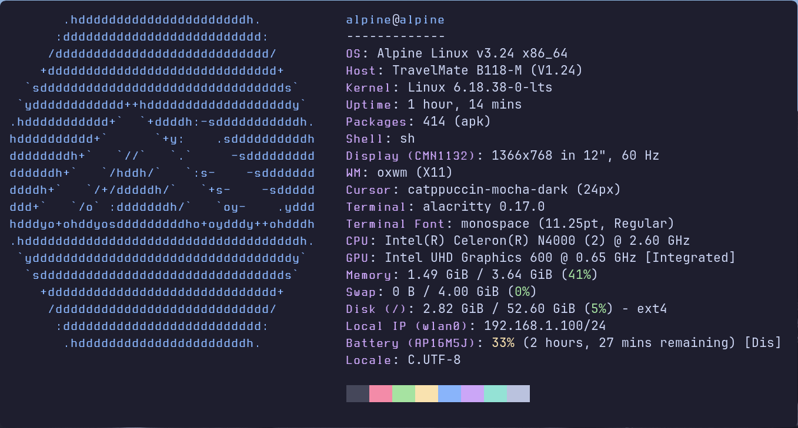

# oxwm-catppuccin-mocha-rice
an simple but strong oxwm rice based on catppuccin mocha... it will include dotfiles for oxwm, picom, grub and rofi

## Things Needed For The Dotfiles
- window manager: oxwm
- terminal: alacritty
- application launcher: rofi
- compositor (for rounded corners): picom
- wallpaper setter: feh
- bootloader (for system): grub
- system fetch (optional): fastfetch
- screnshoot tool (optional):  flameshot
- font for the bar (optional but default in the config): jetbrains mono nerd

## Showcase

